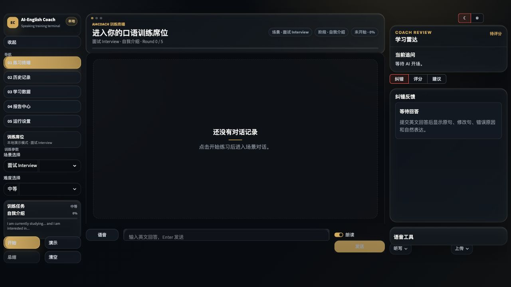
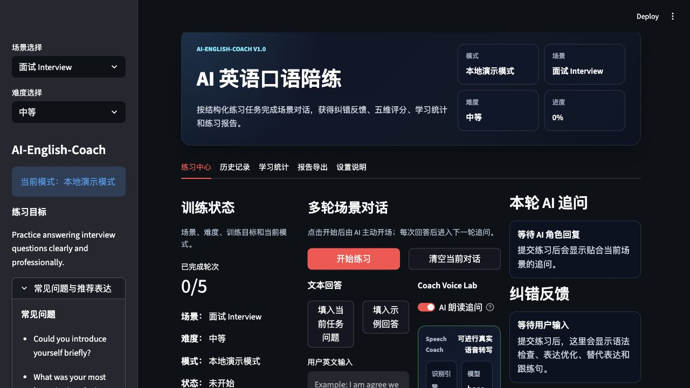
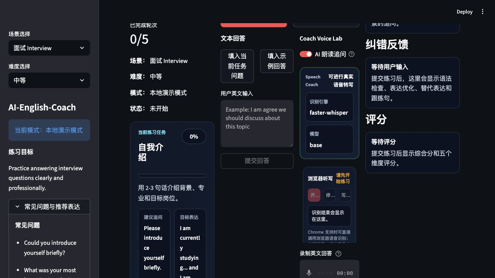
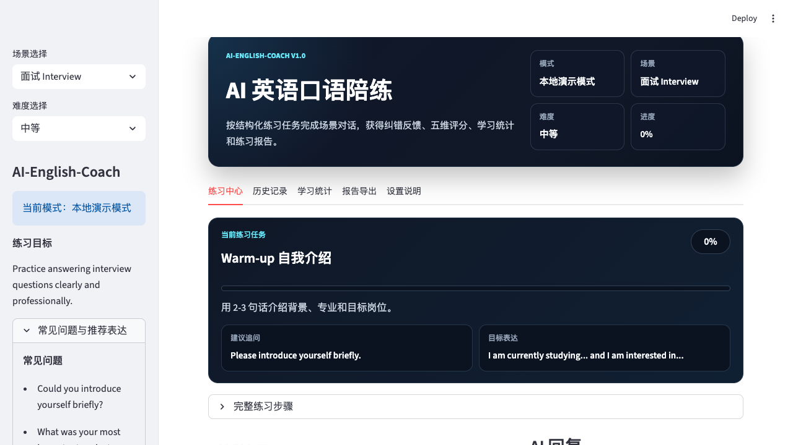
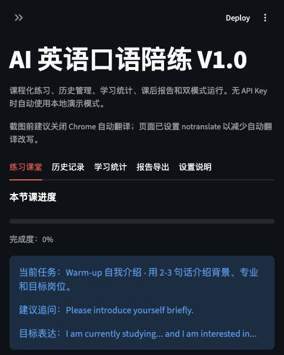
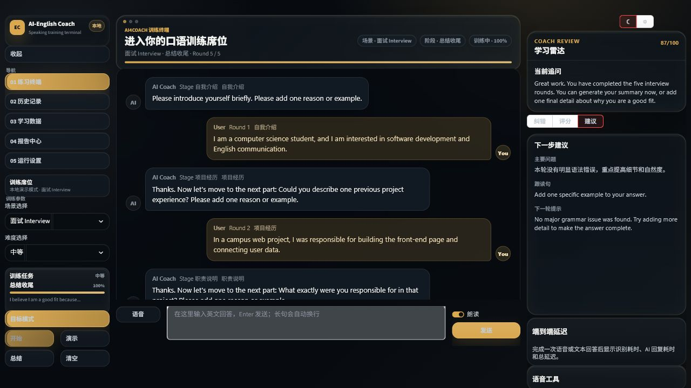
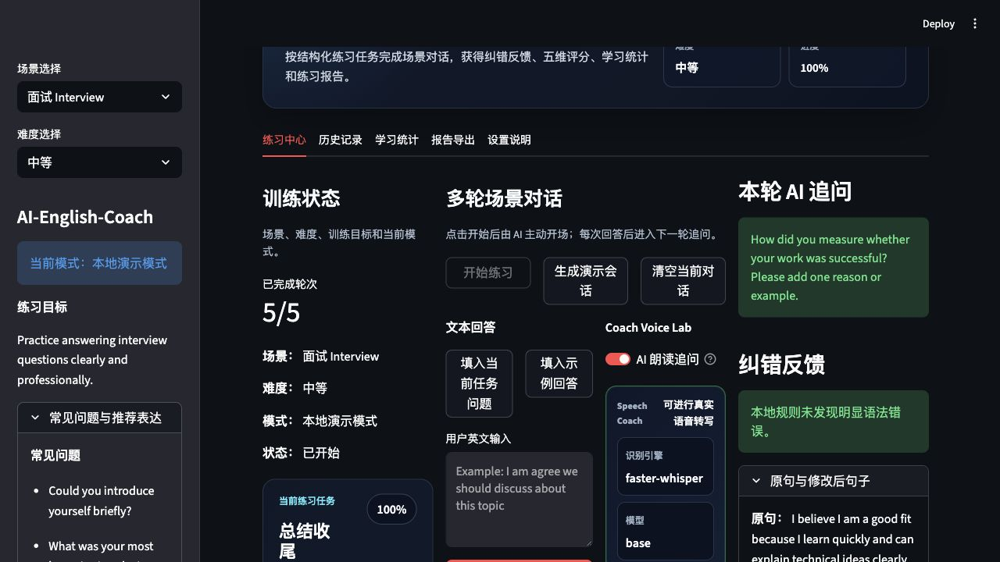
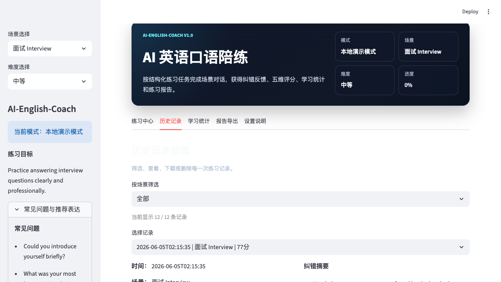
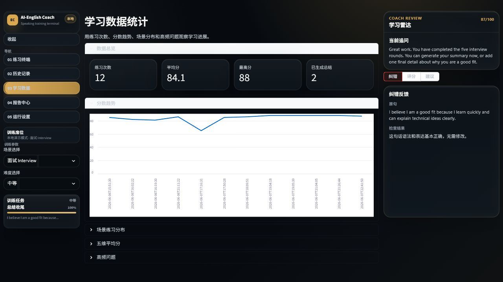
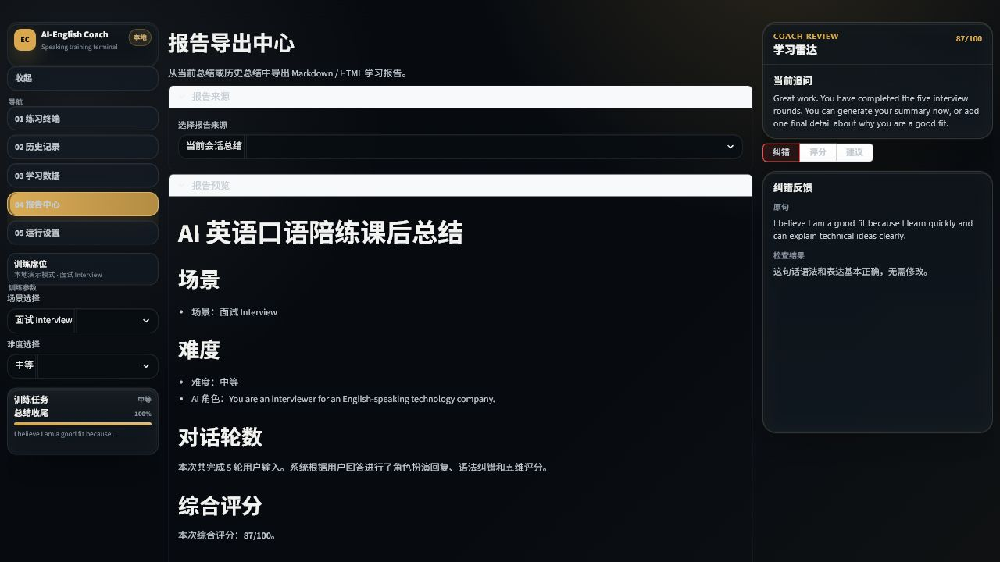

# AI-English-Coach

AI-English-Coach 是一个面向比赛展示的 AI 英语口语陪练系统。项目使用 Python 和 Streamlit 实现，支持面试、点餐、会议三类场景。用户可以通过英文文本、录音或音频文件进行多轮场景对话训练，系统会主动追问、纠正语法和表达、给出五维评分，并生成课后学习报告。

项目支持两种运行方式：没有 `OPENAI_API_KEY` 时自动进入本地演示模式，完整跑通核心流程；配置 API Key 后可切换到更自然的 AI 生成模式。第一版重点是稳定、可本地运行、可现场演示、可上传 GitHub 展示。

## 项目界面截图

### 最新三栏训练终端



### 练习中心与语音教练



### 浏览器英文听写



### 多轮对话训练界面



### 纠错反馈与五维评分



### 本轮 Coach 训练动作



### 一键生成 5 轮演示会话



### 历史记录管理



### 学习统计与报告导出

| 学习统计 | 报告导出 |
| --- | --- |
|  |  |

## 项目亮点

- **多轮场景对话**：AI 会根据面试、点餐、会议任务主动开场，并根据用户回答继续追问。
- **语音教练闭环**：支持浏览器英文听写、录音、音频上传、Whisper / faster-whisper 转写和 AI 追问朗读。
- **本地可演示**：没有 API Key、没有数据库、没有登录系统也能完整运行。
- **实时反馈**：每轮回答都会生成纠错、表达优化、替代表达、跟读句、五维评分和本轮 Coach 训练动作。
- **快速展示闭环**：支持一键生成 5 轮演示会话，直接展示总结、历史记录和报告导出。
- **学习沉淀**：自动保存 JSON 历史记录，生成错误本、学习统计和 Markdown / HTML 报告。

## 功能列表

- 场景选择：面试 Interview、点餐 Restaurant Ordering、会议 Business Meeting
- 难度选择：简单、中等、困难
- 英文文本对话练习
- Coach Voice Lab：支持浏览器英文听写、录音转写、音频上传转写，成功后可一键提交进入下一轮 AI 追问
- 音频文件上传：支持 wav、mp3、m4a
- 可选 Whisper / faster-whisper 转写，并在页面显示当前识别引擎状态
- 浏览器英文听写：Chrome 支持 Web Speech API 时，可直接把麦克风识别结果写入回答框
- AI 追问浏览器朗读：使用 SpeechSynthesis 播放最新 AI 追问
- API 模式与本地演示模式自动切换
- 场景化 AI 角色扮演回复
- 规则化语法纠错和表达优化
- 五维口语评分：Pronunciation、Fluency、Grammar、Expression、Completeness；语音回答会记录转写引擎、识别状态、录音时长和估算语速
- 课后总结生成
- 一键生成 5 轮演示会话，便于比赛现场快速展示完整流程
- Markdown 总结导出
- JSON 练习历史保存到 `outputs/`
- 结构化练习步骤和完成度
- 历史记录筛选、查看、删除和 JSON 下载
- 学习统计：练习次数、平均分、最高分、分数趋势、场景分布、高频错误
- HTML 学习报告导出
- Canva 风格比赛展示 PNG 生成，便于直接放入比赛项目说明或展示 PPT

## 技术栈

- Python 3.9+
- Streamlit 1.50+
- JSON 文件存储
- OpenAI Python SDK，可选 API 模式
- faster-whisper 或 whisper，可选音频转写

## 安装方法

进入项目目录：

```bash
cd "/Users/ferdavismuyassar/Documents/qiniu project/AI-English-Coach"
```

创建虚拟环境：

```bash
python3 -m venv .venv
source .venv/bin/activate
```

安装依赖：

```bash
pip install -r requirements.txt
```

可选安装语音转写依赖：

```bash
pip install faster-whisper
```

如果当前网络通过 SOCKS 代理访问 Hugging Face，模型下载可能还需要：

```bash
pip install socksio
```

或：

```bash
pip install openai-whisper
```

快速测试本地音频转写：

```bash
WHISPER_MODEL_SIZE=tiny.en python scripts/test_transcription.py
```

比赛演示建议使用较轻的 `tiny.en` 模型，首次运行会下载模型文件：

```bash
WHISPER_MODEL_SIZE=tiny.en streamlit run app.py
```

## 运行命令

```bash
streamlit run app.py
```

启动后在浏览器中打开 Streamlit 提供的本地地址，通常是：

```text
http://localhost:8501
```

## API 模式和本地演示模式

### 本地演示模式

如果没有检测到 `OPENAI_API_KEY`，系统自动使用本地演示模式：

- 使用预设模板生成 AI 回复
- 使用规则进行语法纠错
- 使用启发式算法生成五维评分
- 使用模板生成课后总结
- 音频模型不可用时提示用户使用文本输入
- 页面会显示语音识别引擎状态；未安装模型时仍可完整完成文本对话训练

### 语音教练闭环

当前版本采用稳定的“语音识别 + 提交式对话”交互：

1. AI 主动提出场景问题，并可由浏览器自动朗读；
2. 用户可以选择浏览器英文听写，直接把麦克风识别结果写入回答框；
3. 用户也可以点击录音控件或上传音频文件；
4. 系统优先使用 `faster-whisper`，其次使用 `whisper` 转写英文；
5. 转写成功后可自动填入输入框或直接提交；
6. AI 根据回答继续追问，并生成纠错、表达优化、跟读句和五维评分；
7. Pronunciation 和 Fluency 会标注语音识别状态、录音时长和估算语速，但未接入音素级发音评测服务时仍属于本地模拟评分。
8. 评分区会给出本轮 Coach 训练动作，例如“补充原因和例子”“放慢语速”“朗读修改后句子”。

这不是全双工实时通话系统，但已经能完成比赛演示所需的“识别我的语音并继续交流”的核心流程。

本地演示模式无需额外 API 花销，适合比赛展示和截图。

### API 模式

如果运行环境存在 `OPENAI_API_KEY`，系统会尝试调用 OpenAI 或 OpenAI-compatible API 生成更自然的回复、纠错和总结。默认模型可通过环境变量 `OPENAI_MODEL` 设置；如果使用第三方兼容接口，可通过 `OPENAI_BASE_URL` 设置接口地址。

```bash
export OPENAI_API_KEY="your_api_key"
export OPENAI_MODEL="gpt-4o-mini"
streamlit run app.py
```

使用官方 OpenAI 接口时可以不设置 `OPENAI_BASE_URL`。如果需要显式设置：

```bash
export OPENAI_BASE_URL="https://api.openai.com/v1"
```

使用第三方 OpenAI-compatible 接口时，把 `OPENAI_BASE_URL` 改成服务商提供的接口地址，例如：

```bash
export OPENAI_API_KEY="your_api_key"
export OPENAI_BASE_URL="https://api.example.com/v1"
export OPENAI_MODEL="gpt-4o-mini"
streamlit run app.py
```

如果 API 调用失败，系统会自动降级为本地演示模式。

## 项目结构

```text
AI-English-Coach/
├── app.py
├── api_client.py
├── analytics.py
├── course_plan.py
├── input_utils.py
├── scenarios.py
├── speech_utils.py
├── evaluator.py
├── feedback.py
├── report_generator.py
├── report_exporter.py
├── storage.py
├── requirements.txt
├── .env.example
├── scripts/
│   ├── check_api.py
│   ├── render_canva_showcase.py
│   ├── smoke_test.py
│   └── test_transcription.py
├── tests/
│   └── test_core.py
├── README.md
├── examples/
│   ├── sample_dialogue.json
│   ├── sample_audio_note.md
│   └── test_meeting_audio.wav
├── outputs/
│   ├── .gitkeep
│   ├── screenshot_final.png
│   ├── screenshot_voice_lab.png
│   ├── screenshot_browser_dictation.png
│   ├── screenshot_demo_session.png
│   └── screenshot_*.png
└── docs/
    ├── design_report.md
    ├── canva_showcase.html
    ├── canva_generation_prompt.md
    ├── figma_canva_handoff.md
    ├── external_design_tool_status.md
    ├── product_design_qa.md
    ├── ui_design_spec.md
    └── verification_checklist.md
```

## 测试方法

运行核心流程自检：

```bash
pytest -q
python scripts/smoke_test.py
python scripts/check_api.py
python scripts/verify_delivery.py
```

自检覆盖三类场景、本地 AI 回复、纠错反馈、五维评分、练习进度、课后总结、JSON 保存更新、历史删除、学习统计、HTML 报告导出、音频转写降级返回和交付截图/文档存在性。

`scripts/check_api.py` 默认只做无花销 dry run，不会发送真实 API 请求。只有显式执行 `python scripts/check_api.py --live` 才会调用 API。

仓库提供 GitHub Actions 模板：`docs/github_actions_ci.yml`。如果当前 GitHub 授权具备 `workflow` 权限，可复制到 `.github/workflows/ci.yml` 启用在线 CI。

建议按以下测试用例验证：

1. 面试场景正常文本输入：选择 Interview，输入 `I worked on a web project last semester.`
2. 点餐场景正常文本输入：选择 Restaurant Ordering，输入 `I would like to order a chicken salad.`
3. 会议场景正常文本输入：选择 Business Meeting，输入 `I suggest that we discuss the main risk first.`
4. 语法错误输入：输入 `I am agree we should discuss about this topic`
5. 空输入：不输入内容直接点击提交，页面应提示而不崩溃。
6. 上传音频但语音模型不可用：页面应提示演示模式并允许继续文本输入。
7. 浏览器英文听写：点击“开始听写”，说一段英文后写入输入框。
8. 录音回答：点击“录制英文回答”，录完后使用“转写到输入框”或“转写并提交回答”。
9. 一键演示：点击“生成演示会话”，确认页面直接出现 5 轮对话、评分、总结和历史记录。
10. 生成并导出课后总结：完成至少 5 轮对话后点击生成总结和导出按钮。

## 纠错反馈怎么看

纠错反馈不是只做“改错”，而是分成几层：

- 语法检查结果：本地规则检查常见错误，例如 `I am agree`、`discuss about`、主谓一致、大小写、标点等。
- 原文和修改后文本：如果有错误，会展示修改后的版本；如果没有明显错误，只展示摘要，避免长文重复占满页面。
- 表达优化建议：即使语法没错，也会提示如何让回答更像口语表达，例如增加具体例子、调整结构、缩短长段落。
- 更自然的口语版本：把书面化或较长的回答改写成更适合朗读/面试回答的版本。
- 可替代表达：给用户下一次可以直接套用的句子。
- 跟练句：给用户下一步练习任务，例如朗读优化后的版本或补充一个例子。

如果页面显示“本地规则未发现明显语法错误”，意思是当前 fallback 规则没有检测到硬性语法错误，不代表这段话已经是最自然的口语表达。因此系统仍会给出口语结构和表达优化建议。

## 已完成的 V1.0 分支

- 练习中心：练习步骤、文本输入、音频上传、对话历史、AI 回复、纠错、评分和总结。
- 历史记录：最近记录预览、完整历史管理、按场景筛选、JSON 下载和删除。
- 学习统计：总次数、平均分、最高分、总结数量、趋势图、场景分布、维度均分和高频问题。
- 报告导出：Markdown 下载和 HTML 报告生成。
- 设置说明：API dry-run、live 测试、语音转写测试和自动化测试命令。
- 视觉与交互设计：深色视觉系统、顶部状态总览、练习任务卡、快捷填入按钮和清晰空状态。
- Figma / Canva 设计交付：已生成 Figma 可编辑设计稿，并提供 Canva 复刻说明。
- Canva 风格本地展示页：`docs/canva_showcase.html` 可用浏览器打开后截图。
- Canva 风格展示 PNG：`outputs/canva_showcase.png` 已生成；也可用 `python scripts/render_canva_showcase.py` 重新生成。
- Canva 生成提示：`docs/canva_generation_prompt.md` 可直接复制到 Canva Magic Design。
- 产品设计 QA：`docs/product_design_qa.md` 按视觉设计、交互设计、信息架构进行验收。
- 非 Canva 完成状态：`docs/non_canva_completion_status.md` 记录本地、Figma、Product Design 和测试验证结果。
- 比赛演示脚本：`docs/competition_demo_script.md` 提供 5 分钟现场讲解流程、截图顺序和评委问答。
- 外部设计工具状态：`docs/external_design_tool_status.md` 记录 Figma / Canva 插件可用性和限制。

Figma 设计稿链接：

```text
https://www.figma.com/design/p7RyLn8dlM23u6Ica8ehsY
```

## 后续优化方向

- 增加真实发音评分服务或本地发音特征分析
- 增加更多场景，例如旅游、比赛演示、电话沟通
- 增加用户练习曲线和分数趋势图
- 支持多轮练习计划和每日任务
- 支持更稳定的结构化 API 输出
- 将历史记录迁移到 SQLite 或轻量数据库
- 增加更多端到端自动化页面截图测试

## 当前暂停项

- Canva 在线设计链接暂不作为本轮交付条件。当前已保留 Canva 风格 HTML、PNG 和生成提示，后续需要时可继续补在线 Canva 设计稿。
